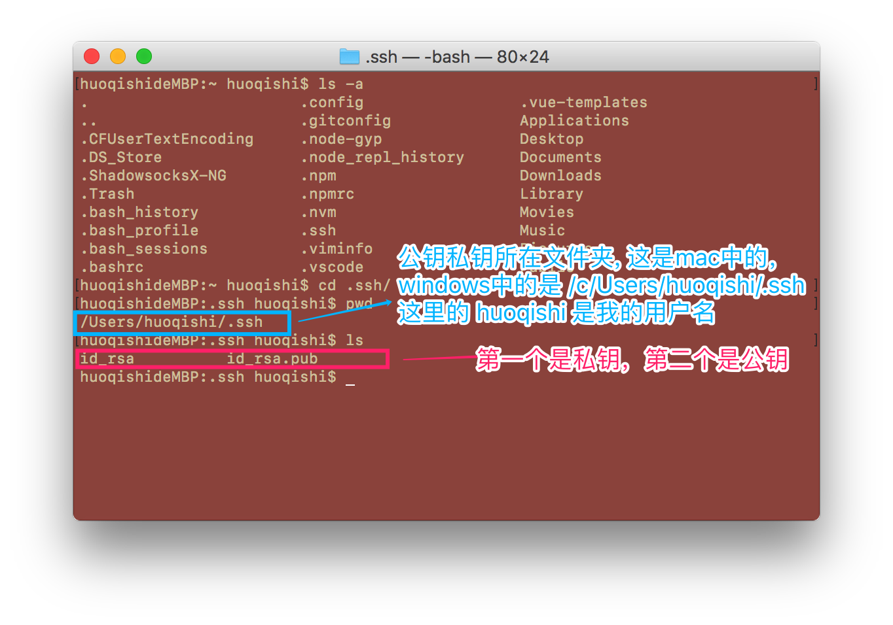
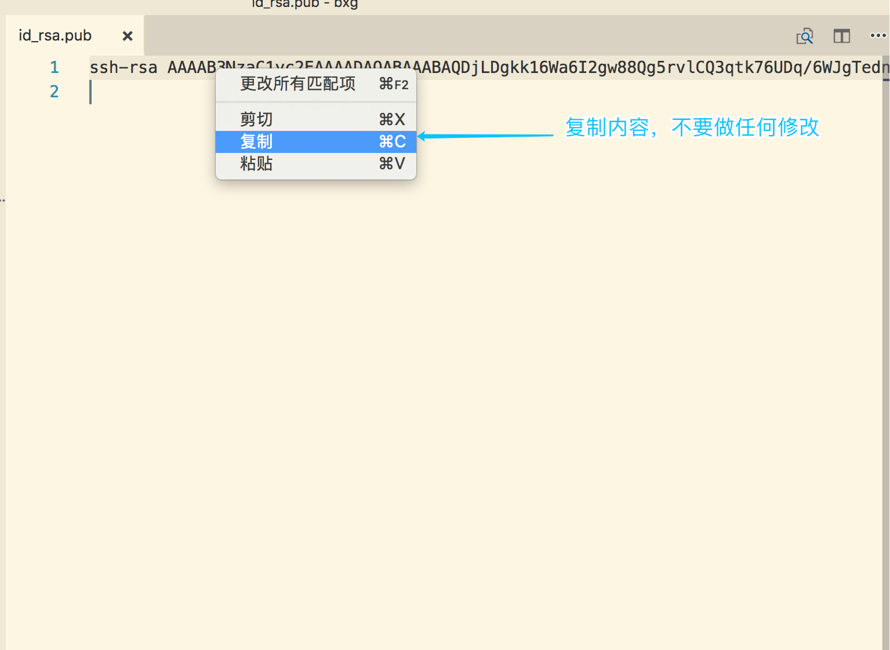
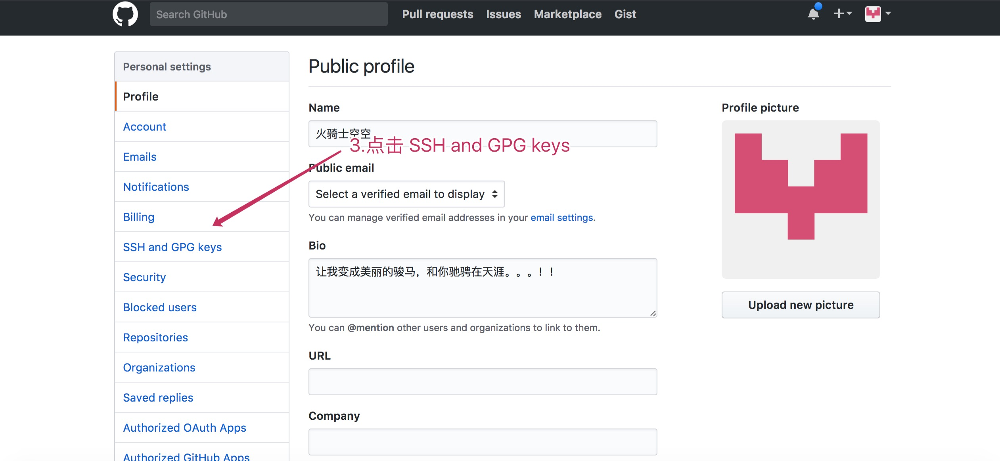
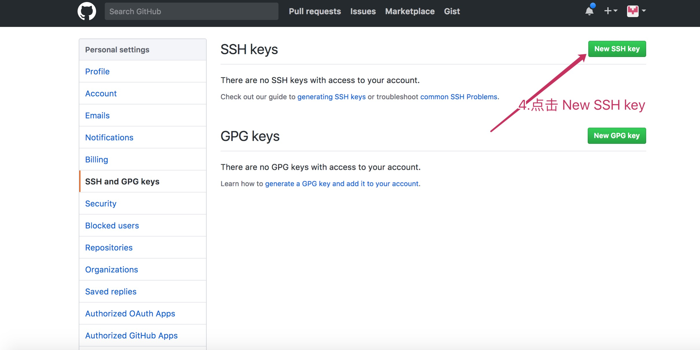
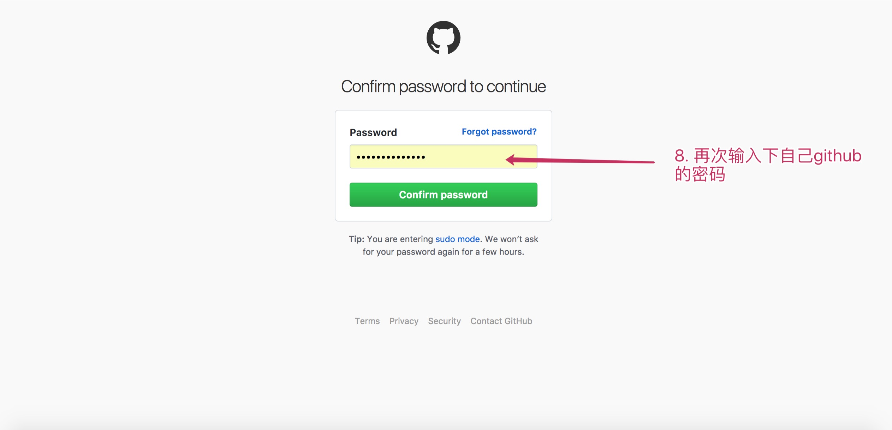

必须要生成SSH公钥，上传到github上去，才能将代码上传到github上
# 生成SSH公钥并添加到github上去!
1. 打开 git bash 输入: `ssh-keygen -t rsa` 命令用于生成公钥和私钥。
> 一直按回车，就会在 [/c/Users/[用户名]/.ssh]  目录中生成两个文件 `id_rsa`和 `id_rsa.pub`  
> 他们分别是私钥和公钥

操作如图:

生成的文件: 

2.复制公钥文件中的内容。
> 用编辑打开 id_rsa.pub 文件，并复制其中的内容

3.添加到github中去
> 打开github 网站并登陆,如何所示操作

继续:

继续  

继续  

继续
